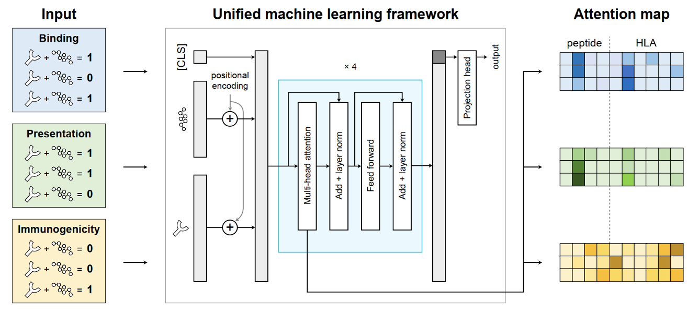
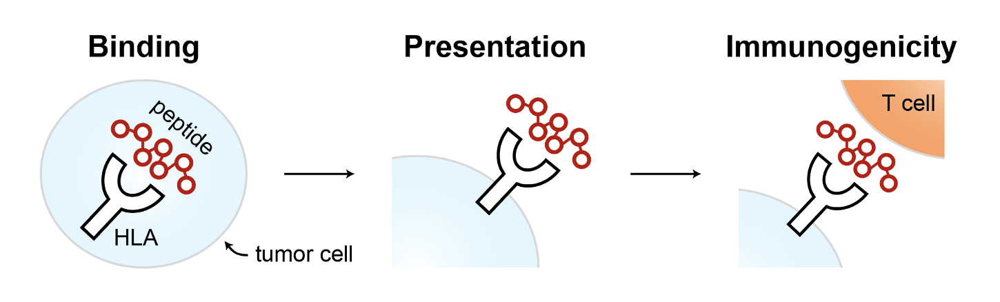
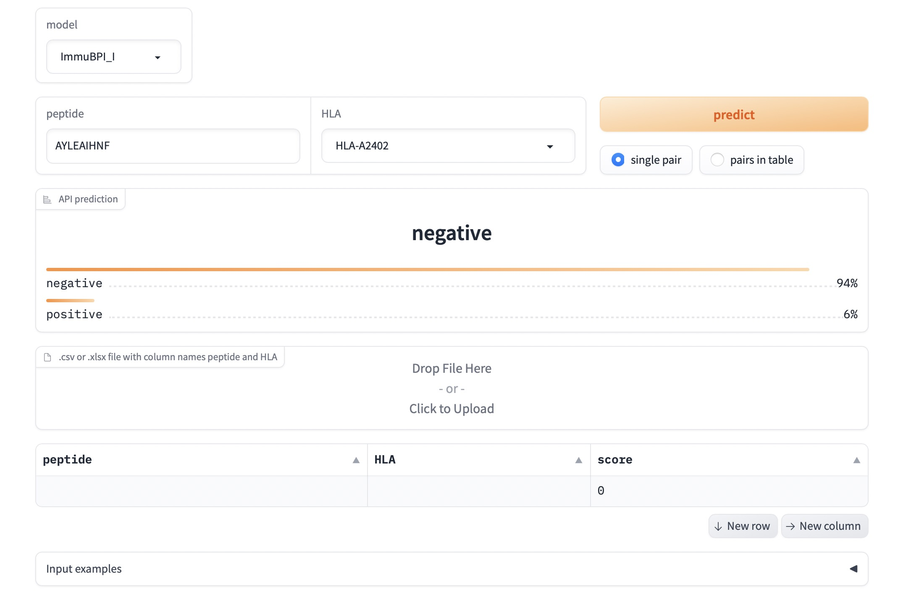

# Cross-task interpretability through unified modeling reveals a universal shortcut bias in neoantigen prediction


This repository provides official implementation for Paper 
*Cross-task interpretability through unified modeling reveals a universal shortcut bias in neoantigen prediction*.



## ⭐️ Backgournd
<div style="text-align:center;">

</div>

There are three main steps in the neoantigen immune process, i.e., binding with MHCs, extracellular presentation, and induction of immunogenicity. ImmuBPI is a unified machine learning framework that comprised  three tasks. 


## ⭐️ Setup 

To use our model or reproduce our work, You need to install some dependency python package. We suggest you to do the dependency installtion in sperated conda environment or container.

To install the dependency, you could do it by
```bash
pip install -r requirements.txt
```

> Note: to faithfully reproduce the training process, we recommend using `cuda 11.8` (by `conda install cudatoolkit=11.8`). In our project setup checking, there is a slight difference in the training process and final performance with `cuda 11.7` or different device driver version. It is due to the operator implementation and precision shifting in cuda. We recommend you follow this step to step up
> 1. Use nvidia GeForce RTX 3090 with driver version `525.125.06`
> 2. `conda install pytorch==2.0.0 torchvision==0.15.0 torchaudio==2.0.0 pytorch-cuda=11.8 -c pytorch -c nvidia`
> 3. `pip install -r requirement.txt`
> 
> For inference-only usage, there is no special version requirement on `cuda` or other driver lib and system lib. Just do the `pip install` command and have fun.


## ⭐️  Train 

You can reproduce the training all of our models, by the all-in-one training bash script.

```bash
./train_bash.sh
```

We will introduce the training details of different models, including dataset preparation and training conifg in following subsections.

### Dataset & Checkpoints
You can download the datasets and model checkpints from 
[https://drive.google.com/drive/folders/1F0lrMcukm1E_aarWf_Xx1vA0SM-VRFlg?usp=sharing](https://drive.google.com/drive/folders/1F0lrMcukm1E_aarWf_Xx1vA0SM-VRFlg?usp=sharing)

After downloading, unzip the downloaded datasets/checkpoints in the `./dataset/` and `./models_saved/` folders

### Training script

To train a single model, just run

```
python run_main.py -c <path to config file>
```

The config file contains the settings of model type, dataset type, training strategy and hyperparameter.

In this repo, we provide a example config file and config files for our best binding, presentation, immunogenicity models in `./configs`. For all the parameter setting, like training learning rate, parts to be masked and so on, please check the commonts in  `./configs/example_config.yaml`.


## ⭐️ Inference 


Scripts with specific functions are provided in `./scripts/`:
- `run_inference.py`
- `get_model_results.py`
- `plot_attention_map.py`
- `generate_embedding.py`

All of these scripts have some same arugments to choose the model and dataset

```
-p  --path  <path to the model checkpoint saved dir(with at least .pt weights and config.yaml file)>
-e --ensemble [True/False] to use model ensemble if `True`, else use the single model for inference
-t --test_dataset <abbreviation of test set>
```

### 🧬 Inference on your own dataset


1.📄  Put your `.csv` file in dataset with format like below (e.g. `dataset/example.csv`): 

<div align="center">

| HLA | peptide | label / immunogenicity (optional) |
|:-------:|:-------:|:-------:|
| HLA-A*24:02 | AYLEAIHHF   | 1
| HLA-A*24:02 | AYLEAIHKF   | 1
| HLA-A*24:02 | AYLEAIHNF   | 0

</div>

2.📎 Pick an abbreviation you like for your custom dataset and register it in `dataset/dataset_register_table.csv` 

<div align="center">

| abbreviation | path |
|:-------:|:-------:|
| my_test | example.csv

</div>

3.🚀 Run inference! You can look up the results file `model_score.csv` at the folder named after your abbreviation saved under the model folder.

```
PYTHONPATH=./ python ./scripts/run_inference.py -p ./models_saved/ImmuBPI_I_Model -e True -t my_test
```


<br>

### 🧬 Inference in GUI

Run
```
python -m webui.webui
```

The open the `localhost:7860` in your browser, you can get a intuitive interface, to help you choose the model, run the inference on a single data sample or your uploaded dataset.


<div style="text-align:center;">

</div>

<br>

### 🧬 Inference directly from command line 
You can also directly use the command line as input for conveniency.

```
PYTHONPATH=./ python ./scripts/get_model_results.py -p ./models_saved/ImmuBPI_I_Model  -e True --peptide AYLEAIHNF AYLEAIHHF AYLEAIHKF AYLEAIHDF --HLA HLA-A24:02
```

<br>


### 🧬 Generate attention map 
Run `plot_attention_map.py` to generate attention map.  You can look up the results file `layers_heatmap.png` at the folder named after your abbreviation saved under the model folder.

```
PYTHONPATH=./ python ./scripts/plot_attention_map.py -p ./models_saved/ImmuBPI_B_Model/Fold_0  -t  TransPHLA_external
```
<br>


### 🧬  Generate model embedding
Run `generate_embedding.py` to generate model embedding. 

```
PYTHONPATH=./ python ./scripts/generate_embedding.py -p ./models_saved/ImmuBPI_I_Model  -t my_test -e 
```

You can look up the results file `transformer_feature.npy` and `transformer_feature.npy` at the folder named after your abbreviation saved under the model folder.

<br>

## ⭐️ Citation

```
@inproceedings{zhang2024discovering,
  title={Discovering and overcoming the bias in neoantigen identification by unified machine learning models},
  author={Zhang, Ziting and Wu, Wenxu and Wei, Lei and Wang, Xiaowo},
  booktitle={International Conference on Research in Computational Molecular Biology},
  pages={348--351},
  year={2024},
  organization={Springer}
}

@article{Zhang2024.02.07.579420,
  author={Zhang, Ziting and Wu, Wenxu and Wei, Lei and Qi, Hai and Wang, Xiaowo},
  title={Unified machine learning framework uncovers overlooked bias control in immunogenic neoantigen identification},
  year={2025},
  eprint= {https://www.biorxiv.org/content/early/2025/01/27/2024.02.07.579420.full.pdf}
}

```

